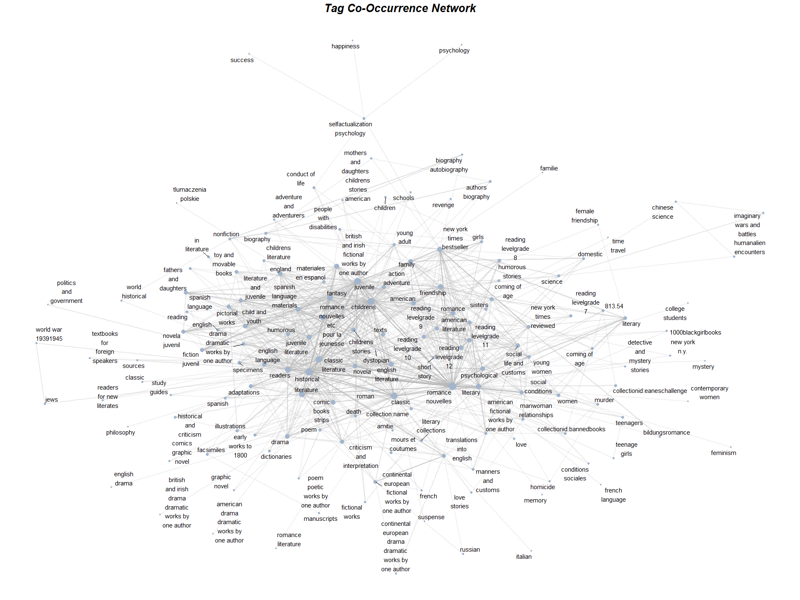
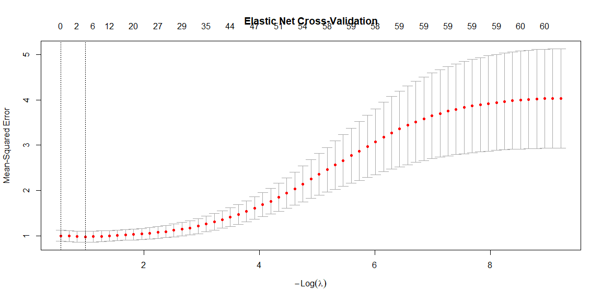
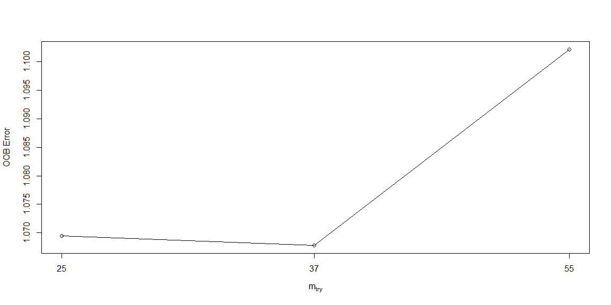
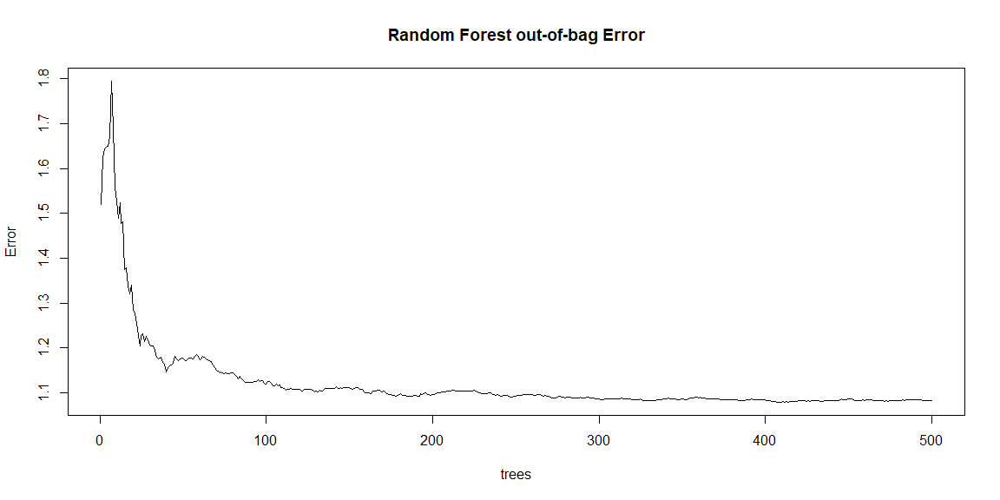
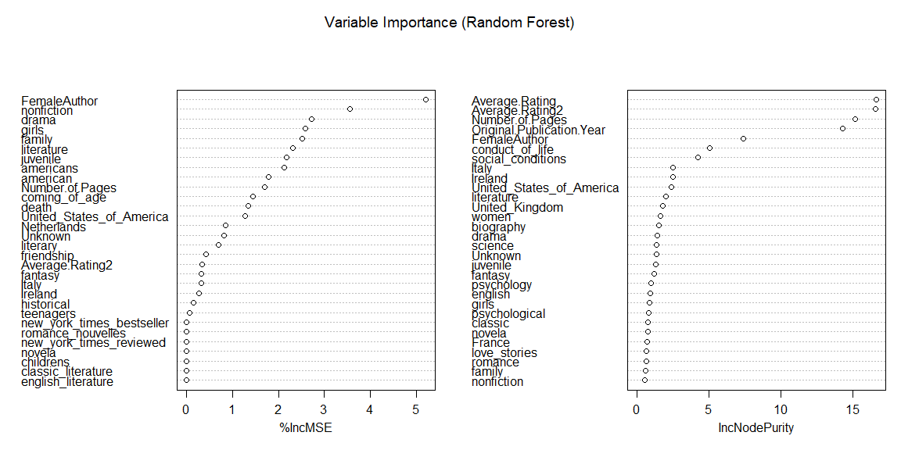

Analysis of my Goodreads data
================

Some exploratory analyses and data visualization of my Goodreads data,
with additional information scraped from Wikidata and Open Library. I
build a co-occurrence network of the tags associated with books in Open
Library, and a prediction model to predict my ratings of books based on
their characteristics.

## Data preprocessing

Load necessary libraries:

``` r
library(dplyr)
library(stringr)
library(lubridate)
library(WikidataQueryServiceR)
library(httr)
library(jsonlite)
library(ggplot2)
library(rnaturalearth)
library(epitools)
library(tidyr)
library(widyr)
library(igraph)
library(ggraph)
library(scales)
library(glmnet)
library(randomForest)
```

I exported my Goodreads data as a CSV file (My Books -\> Tools -\>
Import and export). Read the data:

``` r
data <- read.csv("goodreads_library_export.csv")
```

| Variable | Description |
|:---|:---|
| `Book.Id` | Goodreads book ID |
| `Title` | Book title |
| `Author` | Book author |
| `Author.l.f` | Book author (last name, first name) |
| `Additional.Authors` | Additional authors |
| `ISBN` | ISBN number |
| `ISBN13` | ISBN-13 number |
| `My.Rating` | My rating (1-5 stars) |
| `Average.Rating` | Average rating by all Goodreads users |
| `Publisher` | Publisher |
| `Binding` | Binding (hardcover, paperback, etc.) |
| `Number.of.Pages` | Number of pages |
| `Year.Published` | Year of publication of the edition I read |
| `Original.Publication.Year` | Original publication year |
| `Date.Read` | Date read |
| `Date.Added` | Date added to my Goodreads library |
| `Bookshelves` | What custom book shelves I have assigned the book to |
| `Bookshelves.with.positions` | Position in the bookshelf |
| `Exclusive.Shelf` | Read, to-read, currently-reading |
| `My.Review` | My review of the book |
| `Spoiler` | Spoilers in the review (TRUE/FALSE) |
| `Private.Notes` | Private notes about the book |
| `Read.Count` | Times read |
| `Owned.Copies` | Number of copies I own |

Preliminary data cleaning, removing some outliers and fixing some
formatting issues:

``` r
glimpse(data)
summary(data)
```

``` r
data <- data %>%
  mutate(
    Date.Added = as.Date(Date.Added),
    Date.Read  = as.Date(Date.Read),
    ISBN13     = str_remove_all(ISBN13, '^="|"$'),
    ISBN       = str_remove_all(ISBN, '^="|"$'),
    Title      = gsub("\\s*\\([^\\)]+\\)", "", Title),
    Title      = str_replace_all(Title, c("&" = "&amp;", '"' = '\\"')),
    Original.Publication.Year = ifelse(Original.Publication.Year <= 0, NA, Original.Publication.Year),
    My.Rating  = na_if(My.Rating, 0),
    Number.of.Pages = na_if(Number.of.Pages, 0))

# I started recording in 2020
data$Date.Read[data$Date.Read < as.Date("2020-01-01")] <- NA
```

### Querying additional data

Query other databases for more information on the books.

We can find Author nationality and gender by looking up each author name
on Wikidata:

``` r
get_author_info <- function(author) {

  # SPARQL query
  query <- paste0('
    SELECT ?author ?authorLabel # name
           ?P21 ?P21Label       # gender
           ?P27 ?P27Label       # nationality
    WHERE {
      ?author rdfs:label "', author, '"@en.
      OPTIONAL { ?author wdt:P21 ?P21. }
      OPTIONAL { ?author wdt:P27 ?P27. }
      SERVICE wikibase:label { bd:serviceParam wikibase:language "en". }
    } LIMIT 1
  ')

  # run the query
  res <- query_wikidata(query)

  # keep the properties of interest
  res <- res %>% select(authorLabel, P21Label, P27Label)
  return(res)
}
```

Scrape genre/subject tags from openlibrary.org. ISBN is not a reliable
identifier on Open Library, so we use the title and author name to
search:

``` r
get_book_info <- function(title, author) {
  
  # url of the search "Title Author" on openlibrary
  url <- paste0("https://openlibrary.org/search.json?q=", URLencode(paste(title, author)))
  res <- try(GET(url), silent = TRUE)
  if(inherits(res, "try-error")) return(NA) 
  
  # retrieve the content of the request as a character vector (text)
  jsonfile <- content(res, "text", encoding = "UTF-8")
  
  # read it as an R object
  data <- fromJSON(jsonfile)
  if(is.null(data$docs) || length(data$docs) == 0) return(NA)
  key <- data$docs$key[1] # key of the first result
  if(is.null(key)) return(NA)
  
  # use the key in the url to get the book details
  work_url <- paste0("https://openlibrary.org", key, ".json")
  res2 <- try(GET(work_url), silent = TRUE)
  if(inherits(res2, "try-error")) return(NA)
  
  data2 <- fromJSON(content(res2, "text", encoding = "UTF-8"))
  if(is.null(data2$subjects)) return(NA)
  subjects_clean <- data2$subjects[!is.na(data2$subjects) & data2$subjects != ""]
  out <- c(title, paste(data2$subjects, collapse = "; "))
  return(out) 
}
```

With the following code we can run the queries, format the result and
save it to a file. It takes a few minutes to run, I already did it and
saved the results, so this step can be skipped and the data can be read
from the file directly.

``` r
author_data <- lapply(unique(data[,"Author"]), get_author_info)
author_data <- do.call(rbind, author_data)
colnames(author_data) <- c("Author", "AuthorGender", "AuthorNationality")
write.csv(author_data, "author_data")

book_data <- lapply(seq_len(nrow(data)), function(i) {
  get_book_info(data$Title[i], data$Author[i])
})
book_data <- as.data.frame(do.call(rbind, book_data))
colnames(book_data) <- c("Title", "Subjects")
write.csv(book_data, "book_data")
```

Read data from the files and join it to the original dataset:

``` r
author_data <- read.csv("author_data", stringsAsFactors = FALSE, row.names = 1)
book_data <- read.csv("book_data", stringsAsFactors = FALSE, row.names = 1)
mybooks <- data %>%
  left_join(book_data, by = "Title") %>%
  left_join(author_data, by = "Author")
```

More data cleaning to only keep relevant columns and format:

``` r
mybooks <- mybooks %>% select(Title, Author, My.Rating, Average.Rating, Number.of.Pages, Original.Publication.Year, Date.Read, Exclusive.Shelf, Subjects, AuthorGender, AuthorNationality)
mybooks <- mybooks %>%
  mutate(Season.Read = case_when(month(Date.Read) %in% c(12, 1, 2)  ~ "Winter",
                                 month(Date.Read) %in% c(3, 4, 5)   ~ "Spring",
                                 month(Date.Read) %in% c(6, 7, 8)   ~ "Summer",
                                 month(Date.Read) %in% c(9, 10, 11) ~ "Autumn",
                                 TRUE ~ NA_character_))
# For NA, put Unknown
mybooks <- mybooks %>%
  mutate(AuthorNationality = case_when(AuthorNationality == "United States" ~ "United States of America",
                                       AuthorNationality %in% c("United Kingdom of Great Britain and Ireland", "Kingdom of Great Britain") ~ "United Kingdom",
                                       AuthorNationality == "People's Republic of China" ~ "China",
                                       AuthorNationality == "Kingdom of the Netherlands" ~ "Netherlands",
                                       AuthorNationality == "Kingdom of Italy" ~ "Italy",
                                       AuthorNationality == "Russian Empire" ~ "Russia",
                                       TRUE ~ AuthorNationality)) %>%
  mutate(AuthorNationality = ifelse(is.na(AuthorNationality), "Unknown", AuthorNationality))

mybooks <- mybooks %>%
  mutate(AuthorGender = case_when(AuthorGender == "trans man"   ~ "male",
                                  AuthorGender == "trans woman" ~ "female",
                                  TRUE ~ AuthorGender))
```

| Variable                    | Description                           |
|:----------------------------|:--------------------------------------|
| `Title`                     | Book title                            |
| `Author`                    | Book author                           |
| `My.Rating`                 | My rating (1-5 stars)                 |
| `Average.Rating`            | Average rating by all Goodreads users |
| `Number.of.Pages`           | Number of pages                       |
| `Original.Publication.Year` | Original publication year             |
| `Date.Read`                 | Date read                             |
| `Exclusive.Shelf`           | Read, to-read, currently-reading      |
| `Subjects`                  | Tags/subjects from Open Library       |
| `AuthorGender`              | Author gender                         |
| `AuthorNationality`         | Author nationality                    |
| `Season.Read`               | Season read                           |

The goal now is to analyze the books I have read, so filter the dataset
accordingly. We keep 30% of the read books as a validation set for later
prediction.

``` r
# Set == testing is to-read, Set == training on 70% of read, Set == validation on 30% of read
set.seed(1)
mybooks <- mybooks %>%
  mutate(Set = case_when(Exclusive.Shelf == "to-read" ~ "Test",
                         Exclusive.Shelf == "read" & runif(n()) <= 0.7 ~ "Train",
                         Exclusive.Shelf == "read" & runif(n()) > 0.7 ~ "Validation"))
booksread <- mybooks %>% filter(Exclusive.Shelf == "read")
bookstrain <- booksread %>% filter(Set == "Train")
bookstbr <- mybooks %>% filter(Exclusive.Shelf == "to-read")
```

## Exploratory Data Analysis

This chapter includes data visualization and exploration. Set a custom
ggplot2 theme for plots:

``` r
my_theme <- theme(axis.title.x = element_text(vjust = 0, size = 14),
        axis.title.y = element_text(vjust = 2, size = 14),
        axis.text.x = element_text(angle = 30, vjust = 1, hjust = 1, size = 12),
        axis.text.y = element_text(size = 12),
        plot.title = element_text(hjust = 0, size = 15, face = "bold.italic")) + theme_minimal()

theme_set(my_theme)

colordark <- "#C7522B"
colormedium <- "#419488"
colorlight <- "#F3E3B2" 
```

### Time trends

How many books did I read per month? Many books I marked as read I did
not put a date on (read before I started logging in Jan 2020), so only
consider those with a date here.

The shaded areas correspond to the periods when I was writing my
Bachelor and Master’s theses: I did not have time to read much then. I
read the most during the second wave of the Covid lockdowns.

``` r
ggplot(bookstrain %>% filter(!is.na(Date.Read)),
       aes(x = Date.Read)) +
  geom_histogram(binwidth = 100, fill = "lightsteelblue", color = "white") +
  scale_x_date(date_breaks = "6 month", date_labels = "%b %Y") +
  labs(title = "Books read over time", x = "Date", y = "Number of books") +
  annotate("rect", xmin = as.Date("2020-03-01"), xmax = as.Date("2020-10-07"), ymin = -Inf, ymax = Inf, fill = "lightsteelblue4", alpha = 0.15) +
  annotate("rect", xmin = as.Date("2022-01-01"), xmax = as.Date("2022-09-22"), ymin = -Inf, ymax = Inf, fill = "lightsteelblue4", alpha = 0.15)
```


I read more books in Autumn and Winter.

``` r
ggplot(bookstrain %>% filter(!is.na(Season.Read)), aes(x = Season.Read, fill = Season.Read)) +
  geom_bar() +
  scale_fill_manual(values = c("Autumn" = "#D6A166", "Winter" = "#A1A5EC", "Spring" = "#7EBA68", "Summer" = "#ED90A4")) +
  labs(title = "Books by season read", x = "Season", y = "Number of books") +
  theme(legend.title = element_blank())
```


### Book characteristics

Considering the number of pages: 9.93% of books read are over 500 pages,
while 26.49% are under 200 pages. The average length of the books I read
is around 297 pages. There is a very weak positive correlation between
number of pages and my rating (correlation coefficient = 0.083). The
plot suggests that I tend to give slightly higher ratings to longer
books, but the effect is very small. I also might rate them higher
because if I don’t like a very long book I won’t finish it and therefore
won’t rate it at all. A linear model is fitted through the scatterplot;
the confidence bands show the 95% Gaussian confidence intervals.

``` r
books_per_npages <- bookstrain %>%
  filter(!is.na(Number.of.Pages) & Number.of.Pages < 2000) %>%
  group_by(Pages = (Number.of.Pages %/% 50)*50) %>%
  summarize(count = n())

# Exclude outliers (collections)
ggplot(bookstrain %>%
         filter(!is.na(Number.of.Pages) & Number.of.Pages < 2000),
       aes(x = Number.of.Pages)) +
  geom_histogram(binwidth = 100, fill = "lightsteelblue", color="white") +
  scale_x_continuous(n.breaks = 10) +
  labs(title = "Books read by number of pages", x = "Pages", y = "Number of books")
```


``` r
ggplot(bookstrain %>% filter(!is.na(Number.of.Pages) & Number.of.Pages < 2000),
       aes(x = Number.of.Pages, y = My.Rating)) +
  geom_jitter(width = 5, height = 0.2, alpha = 0.5, color = "lightsteelblue4", pch="\u2605", cex=5) +
  stat_smooth(color = "lightsteelblue3", fill = "lightsteelblue1", method="lm") +
  scale_x_continuous(n.breaks = 20) +
  labs(title = "Ratings by number of pages", x = "Number of pages", y = "Rating")
```


I read many books published in the last 20 years, but also a good number
of classics from the 19th and early 20th century. There is no clear
trend in my ratings by publication year (correlation coefficient =
0.073). A linear model is fitted through the scatterplot; the confidence
bands show the 95% Gaussian confidence intervals.

``` r
ggplot(bookstrain %>% filter(!is.na(Original.Publication.Year) & Original.Publication.Year > 1750),
       aes(x = Original.Publication.Year)) +
  geom_histogram(binwidth = 10, fill = "lightsteelblue", color="white") +
  scale_x_continuous(n.breaks = 10) +
  labs(title = "Books read by publication year", x = "Year", y = "Number of books")
```


``` r
ggplot(bookstrain %>% filter(!is.na(Original.Publication.Year) & Original.Publication.Year > 1830), aes(x = Original.Publication.Year, y = My.Rating)) +
  geom_jitter(width = 0.5, height = 0.2, alpha = 0.5, color = "lightsteelblue4",  pch="\u2605", cex=5) +
  stat_smooth(color = "lightsteelblue3", fill = "lightsteelblue1", method="lm") +
  scale_x_continuous(n.breaks = 10) +
  labs(title = "Ratings by publication year", x = "Year", y = "Rating")
```


### Author characteristics

I read mostly books by authors from the United States, the United
Kingdom, Ireland and Italy, which matches the languages I speak more
fluently.

``` r
world <- ne_countries(scale = "medium", returnclass = "sf")
country_counts <- bookstrain %>% filter(!is.na(AuthorNationality)) %>% count(AuthorNationality)
world_counts <- world %>% left_join(country_counts, by = c("name" = "AuthorNationality")) %>% mutate(books_per_capita = (n / pop_est)*1000000)

# Plot
ggplot(world_counts) +
  geom_sf(aes(fill = books_per_capita)) +
  scale_fill_viridis_c(option = "plasma", na.value = "gray93", trans = "sqrt") +
  labs(title = "Books read per author nationality") +
  theme(legend.title = element_blank())
```


In the time period considered, I read 134 books with known author
gender, of which 73 (54.5%) were written by male authors and 61 (45.5%)
by female authors. Let’s investigate this a bit further. First of all,
is this difference statistically significant? And how does the
proportion of female authors I read compare to the overall publishing
industry? According to a 2021 study, around 33% of commercially
published books are written by women.

The split in author gender in my books is not significantly different
from equal, the 95% confidence interval includes 50%. We can also see
that I read a higher proportion of books by female authors (around
45.52%) compared to the overall publishing industry (33%). This higher
proportion makes sense if we look at the books I rated higher. I gave
average rating of 4.35 to books by female authors compared to 3.68 for
male authors. The difference in average ratings is significant (t-test
p-value = 3.32^{-4}), I tend to rate books written by women higher.

``` r
ggplot(gender_props, aes(fill=gender, y=prop, x=group)) +
  geom_bar(position="stack", stat="identity") +
  geom_hline(yintercept = 0.5, linewidth = 0.5, linetype = 2, col = "grey30") +
  geom_errorbar(data = gender_props %>% filter(group == "My authors", gender == "Female"),
                aes(ymin = lower, ymax = upper), width = 0.2) +
  geom_point(data = gender_props %>% filter(group == "My authors", gender == "Female"), size = 2, show.legend = FALSE) +
  labs(title = "Books read by author gender", x = "", y = "Proportion of books") +
  theme(legend.title = element_blank()) +
  scale_fill_manual(values = c("#A1A5EC", "#ED90A4"))
```


``` r
ratings_gender <- bookstrain %>% filter(!is.na(AuthorGender) & !is.na(My.Rating)) %>%
  count(AuthorGender, My.Rating) %>%
  mutate(count2 = ifelse(AuthorGender == "male", -n, n),
         My.Rating = factor(My.Rating, levels=1:5))

ggplot(ratings_gender, aes(x = count2, y = My.Rating, fill = AuthorGender)) +
  geom_col(width = 0.8) +
  scale_fill_manual(
    name = "Author Gender",
    values = c("female" = "#ED90A4", "male" = "#A1A5EC"),
    labels = c("Female", "Male"),
    guide = guide_legend(override.aes = list(shape = 15, color = NA))  # remove black border
  ) +
  geom_point(
    data = avg_rating,
    aes(x = x, y = avg_rating, shape = "Average"),
    color = "black", size = 5,
    show.legend = TRUE,
    inherit.aes = FALSE
  ) +
  scale_shape_manual(name = "", values = c("Average" = "\u2605"), label = "Average\n rating") +
  scale_x_continuous(labels = abs, name = "Books") +
  scale_y_discrete(name = "Rating") +
  labs(title = "Ratings by author gender") +
  theme(legend.title = element_blank())
```


There is a moderate positive correlation between my ratings and the
average ratings by other readers (correlation coefficient = 0.291), but
I tend to rate books lower than average, with an average rating of 4.01
compared to the Goodreads users’ average rating of 4.02. A quadratic
polynomial is fitted through the scatterplot; the confidence bands show
the 95% Gaussian confidence intervals.

``` r
ggplot(bookstrain %>% filter(!is.na(My.Rating) & !is.na(Average.Rating)),
       aes(x = Average.Rating, y = My.Rating)) +
  geom_jitter(width = 0.2, height = 0.2, alpha = 0.5, color = "lightsteelblue4", pch="\u2605", cex=5) +
  stat_smooth(color = "lightsteelblue3", fill = "lightsteelblue1", method="lm", formula="y~poly(x,2)") +
  scale_x_continuous(breaks = 1:5) +
  scale_y_continuous(breaks = 1:5) +
  labs(title = "My ratings vs. average ratings", x = "Average rating", y = "My rating")
```


### Book tags/subjects

Finally, let’s look at the tags/subjects of the books I read. First we
need to clean and preprocess the tags. We do this on the entire dataset,
then we again split it into read and to-be-read: for the analyses that
follow, we keep working with the read books only (the training data).
Some of the most repetitive work of merging tags can be done more
quickly with the help of AI tools like Github Copilot - a lot more could
be done here, but this is a good start:

``` r
mybooks_tags <- mybooks %>%
  filter(!is.na(Subjects)) %>%
  separate_rows(Subjects, sep = "; ") %>%
  mutate(Subjects = str_replace_all(Subjects, ",", "")) %>%
  mutate(Subjects = tolower(Subjects)) %>%
  mutate(Subjects = iconv(Subjects, from = "UTF-8", to = "ASCII//TRANSLIT")) %>%
  # Remove "general" and "fiction" when inside phrases
  mutate(Subjects = ifelse(Subjects != "fiction",
                           str_replace_all(Subjects, "\\b(general|fiction)\\b", "") %>% str_squish(),
                           Subjects)) %>%
  mutate(Subjects = str_replace_all(Subjects, c(
    "science fiction" = "sci-fi",
    "ciencia-ficcion" = "sci-fi",
    "ficcion" = "fiction",
    "fiction, general" = "fiction",
    "fiction & literature" = "fiction",
    "fiction / thriller" = "thriller",
    "fiction / suspanse" = "suspanse",
    "gender studies" = "gender",
    "fantasy fiction" = "fantasy",
    "historical fiction" = "historical",
    "young adult fiction" = "young adult",
    "children's fiction" = "children's",
    "graphic novels" = "graphic novel",
    "graphic fiction" = "graphic novel",
    "nonfiction" = "non-fiction",
    "memoirs" = "memoir",
    "biographies" = "biography",
    "history" = "historical",
    "literary fiction" = "fiction",
    "classics" = "classic",
    "novels" = "novel",
    "short stories" = "short story",
    "poetry" = "poem",
    "essays" = "essay",
    "crime fiction" = "crime",
    "mystery fiction" = "mystery",
    "thrillers" = "thriller",
    "horror fiction" = "horror",
    "romance fiction" = "romance",
    "fiction / literary" = "fiction",
    "science-fiction" = "sci-fi",
    "fiction historical general" = "historical",
    "fiction sci-fi general" = "sci-fi",
    "families" = "family",
    "fiction family life" = "family",
    "friendship fiction" = "friendship",
    "romans" = "romance",
    "fiction historical" = "historical",
    "fiction mystery & detective general" = "mystery",
    "fiction thriller suspense" = "thriller",
    "histoire" = "historical",
    "fiction humorous general" = "humor",
    "biografia" = "biography",
    "family life" = "family",
    "fiction / coming of age" = "coming of age",
    "fiction coming of age" = "coming of age",
    "fiction classic" = "classic"
  )))  %>%
  filter(!Subjects %in% c("fiction", "open_syllabus_project", "general", "",
                          "long now manual for civilization",
                          "large type books", "open library staff picks", "chang pian xiao shuo")) %>%
  mutate(Subjects = str_replace_all(Subjects, "[,\\(\\)&/\\-']", ""))
```

Visualize the most common tags:

``` r
tags <- mybooks_tags %>%
  group_by(SubjectList = Subjects) %>%
  summarise(Count = n()) %>%
  arrange(desc(Count))

# only for read books, with at least 10 occurrences
tags_train <- mybooks_tags %>%
  filter(Set == "Train") %>%
  group_by(SubjectList = Subjects) %>%
  summarise(Count = n()) %>%
  arrange(desc(Count)) %>%
  filter(Count >= 10)

ggplot(tags_train, aes(x = reorder(SubjectList, Count), y = Count)) +
  geom_bar(stat = "identity", fill = "lightsteelblue") +
  coord_flip() +
  scale_x_discrete(labels = function(x) str_wrap(x, width = 15)) +
  labs(title = "Most Common Tags", x = "Tag", y = "Occurrence in Read Books") +
  theme_bw() +
  theme(axis.title.x = element_text(vjust = 0, size = 14),
        axis.title.y = element_text(vjust = 2, size = 14),
        axis.text.x = element_text(angle = 0, vjust = 1, hjust = 0.5, size = 12),
        axis.text.y = element_text(size = 12),
        plot.title = element_text(hjust = 0, size = 20, face = "bold.italic"))
```


We can also look at how tags co-occur in books, to see which topics are
often read together, with a co-occurrence network:

``` r
tags_cooccur <- mybooks_tags %>%
  filter(Set == "Train") %>%
  select(Title, Subjects) %>%
  distinct() %>%
  pairwise_count(item = Subjects, feature = Title, sort = TRUE)
tags_cooccur <- tags_cooccur %>% filter(n >= 3)  # only keep edges with at least 3 co-occurrences

tags_nodes <- data.frame(name = unique(c(tags_cooccur$item1, tags_cooccur$item2)))
tags_edges <- tags_cooccur %>% rename(from = item1, to = item2, weight = n)
tags_graph <- graph_from_data_frame(d = tags_edges, vertices = tags_nodes, directed = FALSE)
V(tags_graph)$degree <- scales::rescale(degree(tags_graph), to = c(3,12))

ggraph(tags_graph, layout = "kk") +
  geom_edge_link(aes(alpha = rescale(weight)), width = 1, color = "gray70", show.legend = TRUE) +
  scale_edge_width(range = c(0.2, 2)) +
  geom_node_point(aes(size = rescale(degree)), color = "lightsteelblue3", show.legend = FALSE) +
  geom_node_text(aes(label = str_wrap(name, width = 10)), size = 4, max.overlaps = 10, repel = TRUE, family = "sans") +
  theme_void() + 
  labs(title = "Tag Co-Occurrence Network") +
  theme(legend.position = "none",
        plot.title = element_text(hjust = 0.5, size = 20, face = "bold.italic"))
```



## Prediction

In this section we build a model to predict my rating of a book based on
its features. We preprocess the data, creating dummy variables for
categorical predictors, scaling numeric predictors and splitting the
data into training and validation sets. As categorical predictors we
use:

- Average rating by Goodreads users (including the quadratic term, as
  suggested by the exploratory analysis)

- Number of pages

- Original publication year

- Author gender (female or not)

- Author nationality

- Book tags/subjects

``` r
# remove NAs in the features we want to use
mybooks_clean <- mybooks %>% filter(!is.na(Average.Rating) & !is.na(Number.of.Pages) & !is.na(Original.Publication.Year))

# Transform Authorgender into a dummy
mybooks_clean$FemaleAuthor <- ifelse(mybooks_clean$AuthorGender == "female", 1, 0)
mybooks_clean$FemaleAuthor[is.na(mybooks_clean$AuthorGender)] <- 0
mybooks_clean <- mybooks_clean %>% select(-AuthorGender)

# create a dummy column for each author nationality and keep the 10 most common
top_nationalities <- mybooks_clean %>%
  group_by(AuthorNationality) %>%
  summarise(Count = n()) %>%
  arrange(desc(Count)) %>%
  head(10) %>%
  pull(AuthorNationality)

# attach the dummies for nationalities, without spaces
for(nation in top_nationalities) {
  mybooks_clean[[gsub(" ", "_", nation)]] <- ifelse(mybooks_clean$AuthorNationality == nation, 1, 0)
}
mybooks_clean <- mybooks_clean %>% select(-AuthorNationality)

top_tags <- tags$SubjectList[1:100]
for(tag in top_tags) {
  # remove space at the beginning and end, substitute with _ if in the middle
  clean_tag <- trimws(tag)
  col_name <- gsub(" ", "_", clean_tag)
  mybooks_clean[[col_name]] <- ifelse(grepl(paste0("\\b", clean_tag, "\\b"), mybooks_clean$Subjects), 1, 0)
}
mybooks_clean <- mybooks_clean %>% select(-Subjects)

# log-transform the response variable
# mybooks_clean$LogMyRating <- log(mybooks_clean$My.Rating)

read_clean <- mybooks_clean %>% filter(Exclusive.Shelf == "read")
tbr_clean <- mybooks_clean %>% filter(Exclusive.Shelf == "to-read")

# Predict my rating based on book features
# remove variables that are not predictors

read_clean <- read_clean %>% select(-c(Title, Author, Date.Read, Exclusive.Shelf, Season.Read))

# Use log-transform as response, remove NAs in response
read_clean <- read_clean %>% filter(!is.na(My.Rating))

# split read books into training and validation sets
validation <- read_clean %>% filter(Set == "Validation")
training <- read_clean %>% filter(Set == "Train")
testing <- tbr_clean

# first, scale the numeric predictors
training <- training %>%
  mutate(Average.Rating = scale(Average.Rating),
         Number.of.Pages = scale(Number.of.Pages),
         Original.Publication.Year = scale(Original.Publication.Year))

validation <- validation %>%
  mutate(Average.Rating = scale(Average.Rating),
         Number.of.Pages = scale(Number.of.Pages),
         Original.Publication.Year = scale(Original.Publication.Year))

testing <- testing %>%
  mutate(Average.Rating = scale(Average.Rating),
         Number.of.Pages = scale(Number.of.Pages),
         Original.Publication.Year = scale(Original.Publication.Year))

# Identify predictor columns present in all sets
predictor_cols <- intersect(intersect(colnames(training), colnames(validation)), colnames(testing))

# Remove response from predictors
predictor_cols <- predictor_cols[!predictor_cols %in% c("My.Rating", "Set")]

# Prepare the model matrix and the response in both sets
x_train <- as.matrix(training[, predictor_cols])

# we include the quadratic term for Average.Rating, as per our exploratory analysis
x_train <- cbind(x_train, training$Average.Rating^2)
colnames(x_train)[ncol(x_train)] <- "Average.Rating2"
y_train <- training$My.Rating
xy_train <- as.data.frame(cbind(y_train, x_train))
colnames(xy_train)[1] <- "My.Rating"

x_val <- as.matrix(validation[, predictor_cols])
x_val <- cbind(x_val, validation$Average.Rating^2)
colnames(x_val)[ncol(x_val)] <- "Average.Rating2"
y_val <- validation$My.Rating
xy_val <- as.data.frame(cbind(y_val, x_val))
colnames(xy_val)[1] <- "My.Rating"

x_test <- as.matrix(testing[, predictor_cols])
x_test <- cbind(x_test, testing$Average.Rating^2)
colnames(x_test)[ncol(x_test)] <- "Average.Rating2"
```

We fit two different models: an elastic net regression and a random
forest. We compare their performance on the validation set using mean
squared error (MSE). For further analysis (not displayed here) we could
also try to predict whether I will like a book (rating \>=4) or not
(rating \<4), or use a response with 5 levels and do ordinal regression.

``` r
# Model 1: Elastic net regression
model_en <- cv.glmnet(x_train, y_train, alpha = 0.5, lambda.min.ratio = 1e-10, type.measure = "mse")
best_lambda <- model_en$lambda.min
plot(model_en, main = "Elastic Net Cross-Validation")
```



``` r
en_coef <- coef(model_en, s = best_lambda)
selected_vars <- rownames(en_coef)[which(en_coef != 0)]

# Evaluate on validation set
predictions_val <- predict(model_en, s = best_lambda, newx = x_val)
mse_en <- mean((y_val - predictions_val)^2)
print(paste("Validation MSE (Elastic net):", round(mse_en, 4)))
```

    ## [1] "Validation MSE (Elastic net): 0.4912"

``` r
# Model 2: Random Forest
# select mtry
mtry_tuned <- tuneRF(x_train, y_train, stepFactor = 1.5, improve = 0.01, ntreeTry = 500)
```

    ## mtry = 37  OOB error = 1.067807 
    ## Searching left ...

    ## mtry = 25    OOB error = 1.069502 
    ## -0.001587594 0.01 
    ## Searching right ...

    ## mtry = 55    OOB error = 1.102166 
    ## -0.03217719 0.01



``` r
mtry_tuned_value <- mtry_tuned[which.min(mtry_tuned[, 2]), 1]
model_rf <- randomForest(My.Rating ~ ., data = xy_train, 
                         ntree = 500, nodesize=1, mtry=mtry_tuned_value, importance = TRUE)
plot(model_rf, main="Random Forest out-of-bag Error")
```



``` r
varImpPlot(model_rf, main = "Variable Importance (Random Forest)")
```



``` r
# Evaluate on validation set
predictions_val_rf <- predict(model_rf, newdata = xy_val)
mse_rf <- mean((y_val - predictions_val_rf)^2)
print(paste("Validation MSE (Random Forest):", round(mse_rf, 4)))
```

    ## [1] "Validation MSE (Random Forest): 0.6293"

The elastic net model, with the penalty parameter selected using
cross-validation (the value of the parameter which minimizes the
cross-validation MSE, as seen in the plot), selected the following
variables as important predictors of my ratings: FemaleAuthor,
conduct_of_life, Average.Rating2.

We set the number of trees in the random forest to 500 (the more trees,
the better the performance, but also the longer the computation time).
From the out-of-bag error plot we can see that this number of trees is
more than sufficient for the error to stabilize. The `mtry` parameter
indicates how many variables to consider at each split, we select its
optimal value based on the out-of-bag error.

The most important variables in the random forest model are shown in the
variable importance plot. On the left panel, the variables are ranked
based on how much removing them decreases the model accuracy and the
right panel shows the increase in mean squared error when the variable
is permuted. The most important predictors are FemaleAuthor, nonfiction,
drama, girls, family.

The random forest model performed better on the validation set (MSE =
0.6293) compared to the elastic net (MSE = 0.4912). Therefore, we will
use the random forest model to predict my ratings for the books in the
to-read list.

``` r
# Predict ratings for the to-read list with the random forest model
predictions_test <- predict(model_rf, newdata = as.data.frame(x_test))
tbr_clean$Predicted.My.Rating <- as.numeric(predictions_test)
tbr_clean <- tbr_clean %>%
  arrange(desc(Predicted.My.Rating)) %>%
  select(Title, Author, Predicted.My.Rating)

# Table of top 10 recommended books to read
top10_recommendations <- tbr_clean[1:10, ]
knitr::kable(top10_recommendations, col.names = c("Title", "Author", "Predicted My Rating"), digits = 2)
```

| Title | Author | Predicted My Rating |
|:---|:---|---:|
| The Joy Luck Club | Amy Tan | 4.59 |
| Wild: From Lost to Found on the Pacific Crest Trail | Cheryl Strayed | 4.56 |
| The Artist’s Way: A Spiritual Path to Higher Creativity | Julia Cameron | 4.55 |
| The Secret Magdalene | Ki Longfellow | 4.54 |
| The Capital Order: How Economists Invented Austerity and Paved the Way to Fascism | Clara E. Mattei | 4.52 |
| Counting the Cost | Jill Duggar | 4.51 |
| The House of the Spirits | Isabel Allende | 4.51 |
| I Know Why the Caged Bird Sings | Maya Angelou | 4.50 |
| Quiet: The Power of Introverts in a World That Can’t Stop Talking | Susan Cain | 4.49 |
| Ladyparts | Deborah Copaken | 4.49 |
