Exploratory analysis of my Goodreads data
================

Some exploratory analyses and data visualization of my Goodreads data,
with additional information scraped from Wikidata and Open Library.

## Data preprocessing

Load necessary libraries:

``` r
library(dplyr)
library(stringr)
library(lubridate)
library(WikidataQueryServiceR)
library(httr)
library(jsonlite)
library(ggplot2)
library(rnaturalearth)
library(epitools)
library(tidyr)
library(widyr)
library(igraph)
library(ggraph)
library(scales)
```

I exported my Goodreads data as a CSV file (My Books -\> Tools -\>
Import and export). Read the data:

``` r
data <- read.csv("goodreads_library_export.csv")
```

| Variable | Description |
|:---|:---|
| `Book.Id` | Goodreads book ID |
| `Title` | Book title |
| `Author` | Book author |
| `Author.l.f` | Book author (last name, first name) |
| `Additional.Authors` | Additional authors |
| `ISBN` | ISBN number |
| `ISBN13` | ISBN-13 number |
| `My.Rating` | My rating (1-5 stars) |
| `Average.Rating` | Average rating by all Goodreads users |
| `Publisher` | Publisher |
| `Binding` | Binding (hardcover, paperback, etc.) |
| `Number.of.Pages` | Number of pages |
| `Year.Published` | Year of publication of the edition I read |
| `Original.Publication.Year` | Original publication year |
| `Date.Read` | Date read |
| `Date.Added` | Date added to my Goodreads library |
| `Bookshelves` | What custom book shelves I have assigned the book to |
| `Bookshelves.with.positions` | Position in the bookshelf |
| `Exclusive.Shelf` | Read, to-read, currently-reading |
| `My.Review` | My review of the book |
| `Spoiler` | Spoilers in the review (TRUE/FALSE) |
| `Private.Notes` | Private notes about the book |
| `Read.Count` | Times read |
| `Owned.Copies` | Number of copies I own |

Preliminary data cleaning, removing some outliers and fixing some
formatting issues:

``` r
glimpse(data)
summary(data)
```

``` r
data <- data %>%
  mutate(
    Date.Added = as.Date(Date.Added),
    Date.Read  = as.Date(Date.Read),
    ISBN13     = str_remove_all(ISBN13, '^="|"$'),
    ISBN       = str_remove_all(ISBN, '^="|"$'),
    Title      = gsub("\\s*\\([^\\)]+\\)", "", Title),
    Title      = str_replace_all(Title, c("&" = "&amp;", '"' = '\\"')),
    Original.Publication.Year = ifelse(Original.Publication.Year <= 0, NA, Original.Publication.Year),
    My.Rating  = na_if(My.Rating, 0),
    Number.of.Pages = na_if(Number.of.Pages, 0))

# I started recording in 2020
data$Date.Read[data$Date.Read < as.Date("2020-01-01")] <- NA
```

### Querying additional data

Query other databases for more information on the books.

We can find Author nationality and gender by looking up each author name
on Wikidata:

``` r
get_author_info <- function(author) {

  # SPARQL query
  query <- paste0('
    SELECT ?author ?authorLabel # name
           ?P21 ?P21Label       # gender
           ?P27 ?P27Label       # nationality
    WHERE {
      ?author rdfs:label "', author, '"@en.
      OPTIONAL { ?author wdt:P21 ?P21. }
      OPTIONAL { ?author wdt:P27 ?P27. }
      SERVICE wikibase:label { bd:serviceParam wikibase:language "en". }
    } LIMIT 1
  ')

  # run the query
  res <- query_wikidata(query)

  # keep the properties of interest
  res <- res %>% select(authorLabel, P21Label, P27Label)
  return(res)
}
```

Scrape genre/subject tags from openlibrary.org. ISBN is not a reliable
identifier on Open Library, so we use the title and author name to
search:

``` r
get_book_info <- function(title, author) {

  # url of the search "Title Author" on openlibrary
  url <- paste0("https://openlibrary.org/search.json?q=", URLencode(paste(title, author)))
  res <- try(GET(url), silent = TRUE)
  if(inherits(res, "try-error")) return(NA)

  # retrieve the content of the request as a character vector (text)
  jsonfile <- content(res, "text", encoding = "UTF-8")

  # read it as an R object
  data <- fromJSON(jsonfile)
  if(is.null(data$docs) || length(data$docs) == 0) return(NA)
  key <- data$docs$key[1] # key of the first result
  if(is.null(key)) return(NA)

  # use the key in the url to get the book details
  work_url <- paste0("https://openlibrary.org", key, ".json")
  res2 <- try(GET(work_url), silent = TRUE)
  if(inherits(res2, "try-error")) return(NA)
  
  data2 <- fromJSON(content(res2, "text", encoding = "UTF-8"))
  if(is.null(data2$subjects)) return(NA)
  out <- c(title, paste(data2$subjects, collapse = "; ")) # return string with comma-separated tags ("subjects")
  print(title)
  return(out)
}
```

With the following code we can run the queries, format the result and
save it to a file. It takes a few minutes to run, I already did it and
saved the results, so this step can be skipped and the data can be read
from the file directly.

``` r
author_data <- lapply(unique(data[,"Author"]), get_author_info)
author_data <- do.call(rbind, author_data)
colnames(author_data) <- c("Author", "AuthorGender", "AuthorNationality")
write.csv(author_data, "author_data")

book_data <- apply(data %>% select(Title, Author), 1, function(x) get_book_info(x[1], x[2]))
book_data <- as.data.frame(do.call(rbind, book_data))
colnames(book_data) <- c("Title", "Subjects")
write.csv(book_data, "book_data")
```

Read data from the files and join it to the original dataset:

``` r
author_data <- read.csv("author_data", stringsAsFactors = FALSE, row.names = 1)
book_data <- read.csv("book_data", stringsAsFactors = FALSE, row.names = 1)
mybooks <- data %>%
  left_join(book_data, by = "Title") %>%
  left_join(author_data, by = "Author")
```

More data cleaning to only keep relevant columns and format:

``` r
mybooks <- mybooks %>% select(Title, Author, My.Rating, Average.Rating, Number.of.Pages, Original.Publication.Year, Date.Read, Exclusive.Shelf, Subjects, AuthorGender, AuthorNationality)
mybooks <- mybooks %>%
  mutate(Season.Read = case_when(month(Date.Read) %in% c(12, 1, 2)  ~ "Winter",
                                 month(Date.Read) %in% c(3, 4, 5)   ~ "Spring",
                                 month(Date.Read) %in% c(6, 7, 8)   ~ "Summer",
                                 month(Date.Read) %in% c(9, 10, 11) ~ "Autumn",
                                 TRUE ~ NA_character_))
mybooks <- mybooks %>%
  mutate(AuthorNationality = case_when(AuthorNationality == "United States" ~ "United States of America",
                                       AuthorNationality %in% c("United Kingdom of Great Britain and Ireland", "Kingdom of Great Britain") ~ "United Kingdom",
                                       AuthorNationality == "People's Republic of China" ~ "China",
                                       AuthorNationality == "Kingdom of the Netherlands" ~ "Netherlands",
                                       AuthorNationality == "Kingdom of Italy" ~ "Italy",
                                       AuthorNationality == "Russian Empire" ~ "Russia",
                                       TRUE ~ AuthorNationality))
mybooks <- mybooks %>%
  mutate(AuthorGender = case_when(AuthorGender == "trans man"   ~ "male",
                                  AuthorGender == "trans woman" ~ "female",
                                  TRUE ~ AuthorGender))
```

| Variable                    | Description                           |
|:----------------------------|:--------------------------------------|
| `Title`                     | Book title                            |
| `Author`                    | Book author                           |
| `My.Rating`                 | My rating (1-5 stars)                 |
| `Average.Rating`            | Average rating by all Goodreads users |
| `Number.of.Pages`           | Number of pages                       |
| `Original.Publication.Year` | Original publication year             |
| `Date.Read`                 | Date read                             |
| `Exclusive.Shelf`           | Read, to-read, currently-reading      |
| `Subjects`                  | Tags/subjects from Open Library       |
| `AuthorGender`              | Author gender                         |
| `AuthorNationality`         | Author nationality                    |
| `Season.Read`               | Season read                           |

The goal now is to analyze the books I have read, so filter the dataset
accordingly:

``` r
booksread <- mybooks %>% filter(Exclusive.Shelf == "read")
bookstbr <- mybooks %>% filter(Exclusive.Shelf == "to-read")
```

## Exploratory Data Analysis

This chapter includes data visualization and exploration. Set a custom
ggplot2 theme for plots:

``` r
my_theme <- theme_bw() +
  theme(axis.title.x = element_text(vjust = 0, size = 14),
        axis.title.y = element_text(vjust = 2, size = 14),
        axis.text.x = element_text(angle = 30, vjust = 1, hjust = 1, size = 12),
        axis.text.y = element_text(size = 12),
        plot.title = element_text(hjust = 0, size = 15, face = "bold.italic"))

theme_set(my_theme)
```

### Time trends

How many books did I read per month? Many books I marked as read I did
not put a date on (read before I started logging in Jan 2020), so only
consider those with a date here.

The purple shaded areas correspond to the periods when I was writing my
Bachelor and Master’s theses - I did not have time to read much then. I
read the most during the second wave of the Covid lockdowns.

``` r
ggplot(booksread %>% filter(!is.na(Date.Read)),
       aes(x = Date.Read)) +
  geom_histogram(binwidth = 100, fill = "turquoise3", color = "white") +
  scale_x_date(date_breaks = "6 month", date_labels = "%b %Y") +
  labs(title = "Books read over time", x = "Date", y = "Number of books") +
  annotate("rect", xmin = as.Date("2020-03-01"), xmax = as.Date("2020-10-07"), ymin = -Inf, ymax = Inf, fill = "purple1", alpha = 0.15) +
  annotate("rect", xmin = as.Date("2022-01-01"), xmax = as.Date("2022-09-22"), ymin = -Inf, ymax = Inf, fill = "purple1", alpha = 0.15)
```

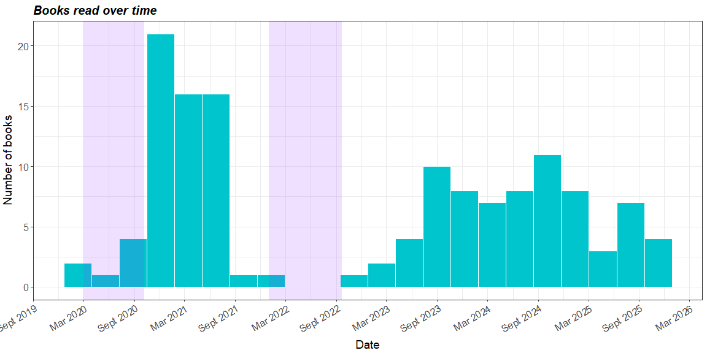

I read more books in Autumn and Winter.

``` r
ggplot(booksread %>% filter(!is.na(Season.Read)), aes(x = Season.Read, fill = Season.Read)) +
  geom_bar() +
  labs(title = "Books by season read", x = "Season", y = "Number of books") +
  theme(legend.title = element_blank())
```

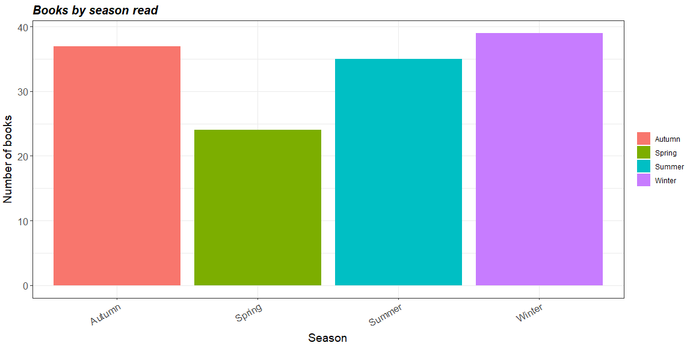

### Book characteristics

Considering the number of pages: 8.68% of books read are over 500 pages,
while 27.85% are under 200 pages. The average length of the books I read
is around 297 pages. There is a very weak positive correlation between
number of pages and my rating (correlation coefficient = 0.078). The
plot suggests that I tend to give slightly higher ratings to longer
books, but the effect is very small. I also might rate them higher
because if I don’t like a very long book I won’t finish it and therefore
won’t rate it at all. A linear model is fitted through the scatterplot;
the confidence bands show the 95% Gaussian confidence intervals.

``` r
books_per_npages <- booksread %>%
  filter(!is.na(Number.of.Pages) & Number.of.Pages < 2000) %>%
  group_by(Pages = (Number.of.Pages %/% 50)*50) %>%
  summarize(count = n())

# Exclude outliers (collections)
ggplot(booksread %>%
         filter(!is.na(Number.of.Pages) & Number.of.Pages < 2000),
       aes(x = Number.of.Pages)) +
  geom_histogram(binwidth = 100, fill = "lightsteelblue", color="white") +
  scale_x_continuous(n.breaks = 10) +
  labs(title = "Books read by number of pages", x = "Pages", y = "Number of books")
```

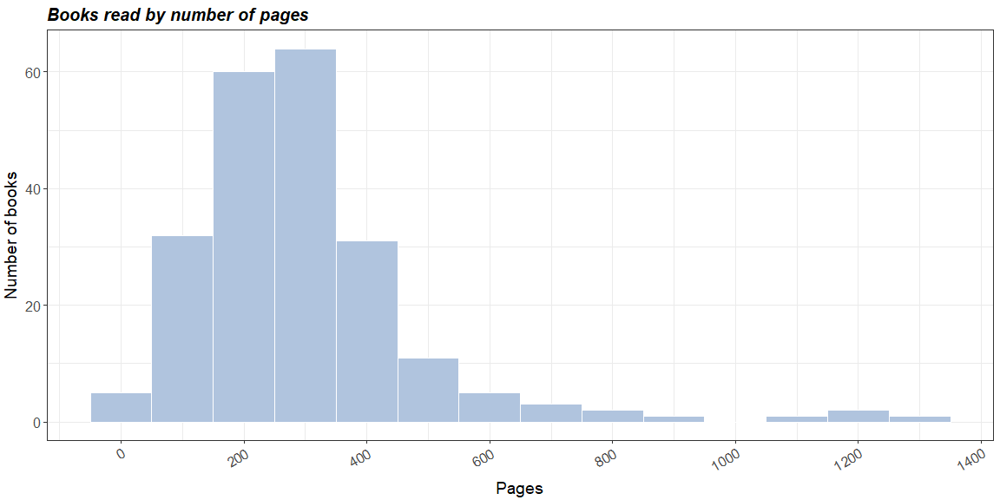

``` r
ggplot(booksread %>% filter(!is.na(Number.of.Pages) & Number.of.Pages < 2000),
       aes(x = Number.of.Pages, y = My.Rating)) +
  geom_jitter(width = 5, height = 0.2, alpha = 0.5, color = "lightsteelblue4", pch="\u2605", cex=5) +
  stat_smooth(color = "lightsteelblue3", fill = "lightsteelblue1", method="lm") +
  scale_x_continuous(n.breaks = 20) +
  labs(title = "Ratings by number of pages", x = "Number of pages", y = "Rating")
```

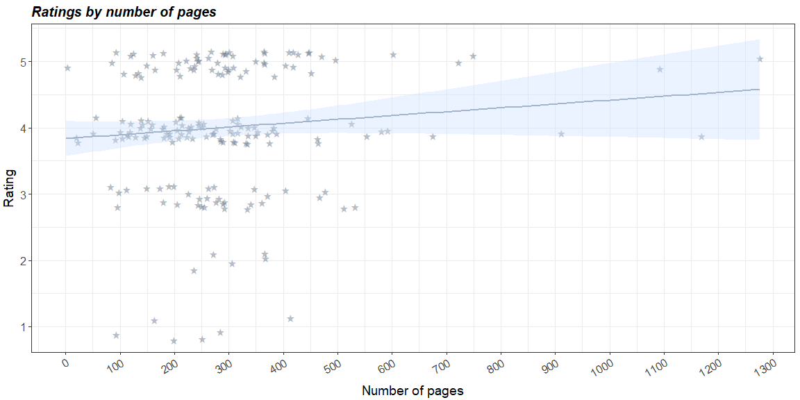

I read many books published in the last 20 years, but also a good number
of classics from the 19th and early 20th century. There is no clear
trend in my ratings by publication year (correlation coefficient =
0.093). A linear model is fitted through the scatterplot; the confidence
bands show the 95% Gaussian confidence intervals.

``` r
ggplot(booksread %>% filter(!is.na(Original.Publication.Year) & Original.Publication.Year > 1750),
       aes(x = Original.Publication.Year)) +
  geom_histogram(binwidth = 10, fill = "sienna3", color="white") +
  scale_x_continuous(n.breaks = 10) +
  labs(title = "Books read by publication year", x = "Year", y = "Number of books")
```

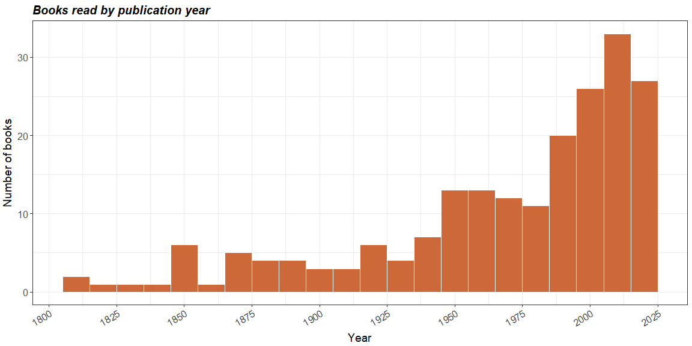

``` r
ggplot(booksread %>% filter(!is.na(Original.Publication.Year) & Original.Publication.Year > 1830), aes(x = Original.Publication.Year, y = My.Rating)) +
  geom_jitter(width = 0.5, height = 0.2, alpha = 0.5, color = "sienna3",  pch="\u2605", cex=5) +
  stat_smooth(color = "sienna4", fill = "wheat3", method="lm") +
  scale_x_continuous(n.breaks = 10) +
  labs(title = "Ratings by publication year", x = "Year", y = "Rating")
```

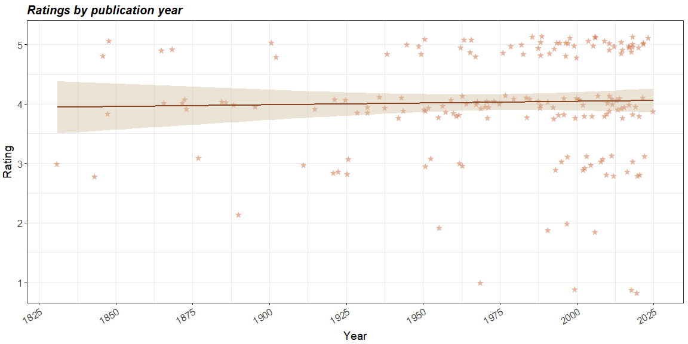

### Author characteristics

I read mostly books by authors from the United States, the United
Kingdom, Ireland and Italy, which matches the languages I speak more
fluently.

``` r
world <- ne_countries(scale = "medium", returnclass = "sf")
country_counts <- booksread %>% filter(!is.na(AuthorNationality)) %>% count(AuthorNationality)
world_counts <- world %>% left_join(country_counts, by = c("name" = "AuthorNationality")) %>% mutate(books_per_capita = (n / pop_est)*1000000)

# Plot
ggplot(world_counts) +
  geom_sf(aes(fill = books_per_capita)) +
  scale_fill_viridis_c(option = "plasma", na.value = "gray93", trans = "sqrt") +
  labs(title = "Books read per author nationality") +
  theme(legend.title = element_blank())
```

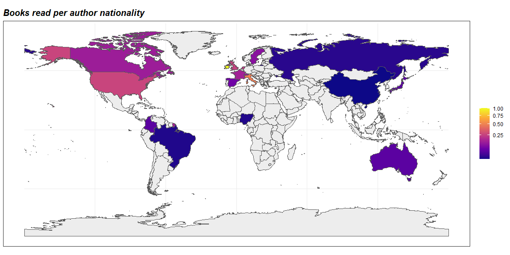

In the time period considered, I read 190 books with known author
gender, of which 108 (56.8%) were written by male authors and 82 (43.2%)
by female authors. Let’s investigate this a bit further. First of all,
is this difference statistically significant? And how does the
proportion of female authors I read compare to the overall publishing
industry? According to a 2021 study, around 33% of commercially
published books are written by women.

The split in author gender in my books is not significantly different
from equal, the 95% confidence interval includes 50% (barely). We can
also see that I read a higher proportion of books by female authors
(around 43.16%) compared to the overall publishing industry (33%). This
higher proportion makes sense if we look at the books I rated higher. I
gave average rating of 4.36 to books by female authors compared to 3.71
for male authors. The difference in average ratings is significant
(t-test p-value = 7.22^{-6}), I tend to rate books written by women
higher.

``` r
ggplot(gender_props, aes(fill=gender, y=prop, x=group)) +
  geom_bar(position="stack", stat="identity") +
  geom_hline(yintercept = 0.5, linewidth = 0.5, linetype = 2, col = "gray") +
  geom_errorbar(data = gender_props %>% filter(group == "My authors", gender == "Female"),
                aes(ymin = lower, ymax = upper), width = 0.2) +
  geom_point(data = gender_props %>% filter(group == "My authors", gender == "Female"), size = 2, show.legend = FALSE) +
  labs(title = "Books read by author gender", x = "", y = "Proportion of books") +
  theme(legend.title = element_blank()) +
  scale_fill_manual(values = c("cornflowerblue", "hotpink1"))
```

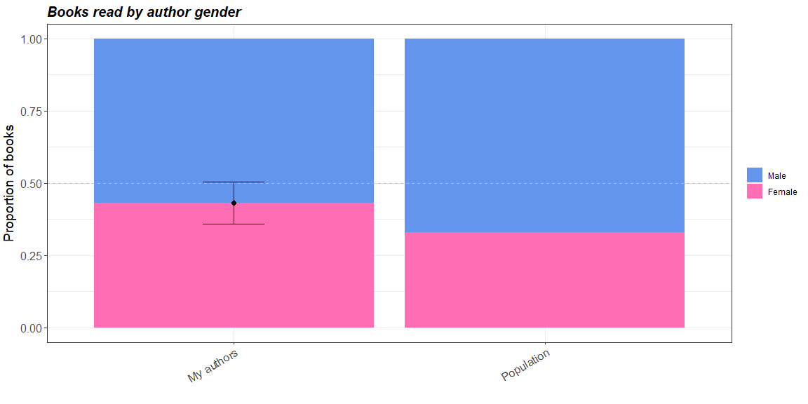

``` r
ratings_gender <- booksread %>% filter(!is.na(AuthorGender) & !is.na(My.Rating)) %>%
  count(AuthorGender, My.Rating) %>%
  mutate(count2 = ifelse(AuthorGender == "male", -n, n),
         My.Rating = factor(My.Rating, levels=1:5))

ggplot(ratings_gender, aes(x = count2, y = My.Rating, fill = AuthorGender)) +
  geom_col(width = 0.8) +
  scale_fill_manual(
    name = "Author Gender",
    values = c("female" = "hotpink1", "male" = "cornflowerblue"),
    labels = c("Female", "Male"),
    guide = guide_legend(override.aes = list(shape = 15, color = NA))  # remove black border
  ) +
  geom_point(
    data = avg_rating,
    aes(x = x, y = avg_rating, shape = "Average"),
    color = "black", size = 5,
    show.legend = TRUE,
    inherit.aes = FALSE
  ) +
  scale_shape_manual(name = "", values = c("Average" = "\u2605"), label = "Average\n rating") +
  scale_x_continuous(labels = abs, name = "Books") +
  scale_y_discrete(name = "Rating") +
  labs(title = "Ratings by author gender") +
  theme(legend.title = element_blank())
```

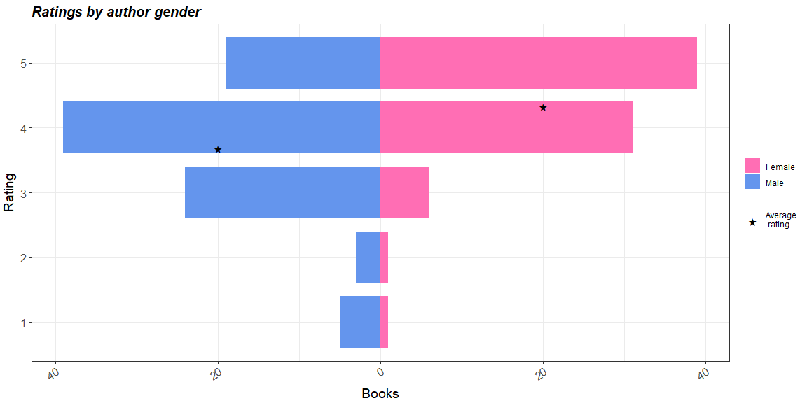

There is a moderate positive correlation between my ratings and the
average ratings by other readers (correlation coefficient = 0.241), but
I tend to rate books lower than average, with an average rating of 4.01
compared to the Goodreads users’ average rating of 4.03. A quadratic
polynomial is fitted through the scatterplot; the confidence bands show
the 95% Gaussian confidence intervals.

``` r
ggplot(booksread %>% filter(!is.na(My.Rating) & !is.na(Average.Rating)),
       aes(x = Average.Rating, y = My.Rating)) +
  geom_jitter(width = 0.2, height = 0.2, alpha = 0.5, color = "purple1", pch="\u2605", cex=5) +
  stat_smooth(color = "purple3", fill = "violet", method="lm", formula="y~poly(x,2)") +
  scale_x_continuous(breaks = 1:5) +
  scale_y_continuous(breaks = 1:5) +
  labs(title = "My ratings vs. average ratings", x = "Average rating", y = "My rating")
```

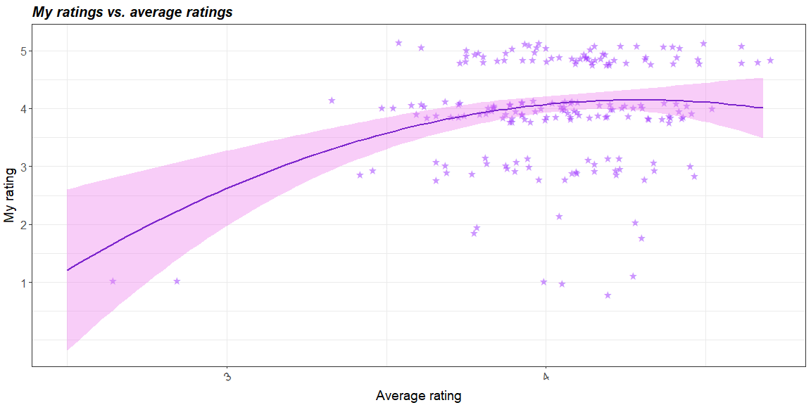

### Book tags/subjects

Finally, let’s look at the tags/subjects of the books I read. First we
need to clean and preprocess the tags. We do this on the entire dataset,
then we again split it into read and to-be-read: for the analyses that
follow, we keep working with the read books only (the training data).
Some of the most repetitive work of merging tags can be done more
quickly with the help of AI tools like Github Copilot - a lot more could
be done here, but this is a good start:

``` r
mybooks_tags <- mybooks %>%
  filter(!is.na(Subjects)) %>%
  separate_rows(Subjects, sep = "; ") %>%
  mutate(Subjects = tolower(Subjects)) %>%
  mutate(Subjects = iconv(Subjects, from = "UTF-8", to = "ASCII//TRANSLIT")) %>%
  mutate(Subjects = str_replace_all(Subjects, c(
    "science fiction" = "sci-fi",
    "ciencia-ficcion" = "sci-fi",
    "ficcion" = "fiction",
    "fiction, general" = "fiction",
    "fiction & literature" = "fiction",
    "fiction / thriller" = "thriller",
    "fiction / suspanse" = "suspanse",
    "gender studies" = "gender",
    "fantasy fiction" = "fantasy",
    "historical fiction" = "historical",
    "young adult fiction" = "young adult",
    "children's fiction" = "children's",
    "graphic novels" = "graphic novel",
    "graphic fiction" = "graphic novel",
    "nonfiction" = "non-fiction",
    "memoirs" = "memoir",
    "biographies" = "biography",
    "history" = "historical",
    "literary fiction" = "literature",
    "classics" = "classic",
    "novels" = "novel",
    "short stories" = "short story",
    "poetry" = "poem",
    "essays" = "essay",
    "crime fiction" = "crime",
    "mystery fiction" = "mystery",
    "thrillers" = "thriller",
    "horror fiction" = "horror",
    "romance fiction" = "romance"
  )))  %>%
  filter(!Subjects %in% c("fiction", "open_syllabus_project", "general", "",
                          "long now manual for civilization",
                          "large type books"))

books_tags_read <- mybooks_tags %>% filter(Exclusive.Shelf == "read")
books_tags_tbr <- mybooks_tags %>% filter(Exclusive.Shelf == "to-read")
```

Visualize the most common tags:

``` r
tags <- books_tags_read %>%
  group_by(SubjectList = Subjects) %>%
  summarise(Count = n()) %>%
  arrange(desc(Count)) %>%
  filter(Count >= 10)
ggplot(tags, aes(x = reorder(SubjectList, Count), y = Count)) +
  geom_bar(stat = "identity", fill = "palegreen4") +
  coord_flip() +
  labs(title = "Most common tags", x = "Tag", y = "Occurrence in read books")
```

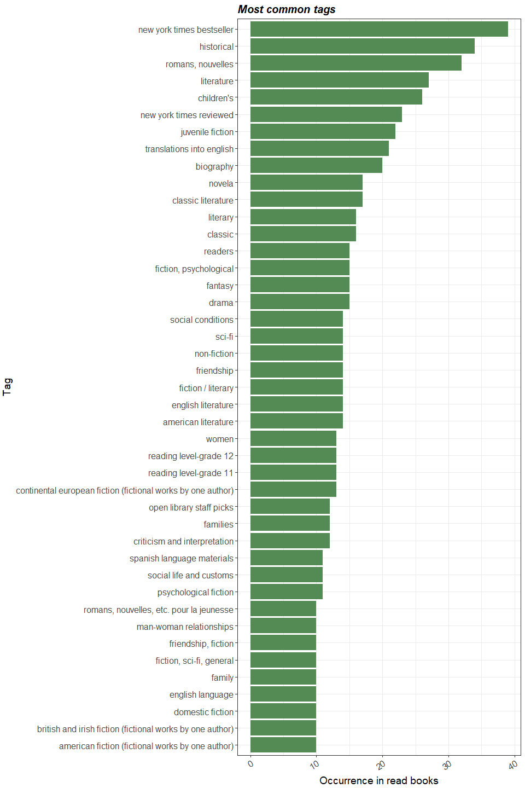

We can also look at how tags co-occur in books, to see which topics are
often read together, with a co-occurrence network:

``` r
tags_cooccur <- books_tags_read %>%
  select(Title, Subjects) %>%
  mutate(Subjects = str_wrap(books_tags_read$Subjects, width = 15)) %>%
  distinct() %>%
  pairwise_count(item = Subjects, feature = Title, sort = TRUE)
tags_cooccur_filtered <- tags_cooccur %>% filter(n >= 5)

tags_nodes <- data.frame(name = unique(c(tags_cooccur_filtered$item1, tags_cooccur_filtered$item2)))
tags_edges <- tags_cooccur_filtered %>% rename(from = item1, to = item2, weight = n)
tags_graph <- graph_from_data_frame(d = tags_edges, vertices = tags_nodes, directed = FALSE)
V(tags_graph)$degree <- scales::rescale(degree(tags_graph), to = c(3,12))

ggraph(tags_graph, layout = "kk") +
  geom_edge_link(aes(alpha = weight), width = 1, color = "gray", show.legend = TRUE) +
  scale_edge_width(range = c(0.2, 2)) +
  geom_node_point(aes(size = rescale(degree)), color = "palegreen4", show.legend = FALSE) +
  geom_node_text(aes(label = name, size = rescale(degree)), max.overlaps = 10, repel = T, family = "sans") +
  theme_void() +
  labs(title = "Tag co-occurrence network") +
  theme(legend.position = "none",
        plot.title = element_text(hjust = 0.5, size = 20, face = "bold.italic"))
```

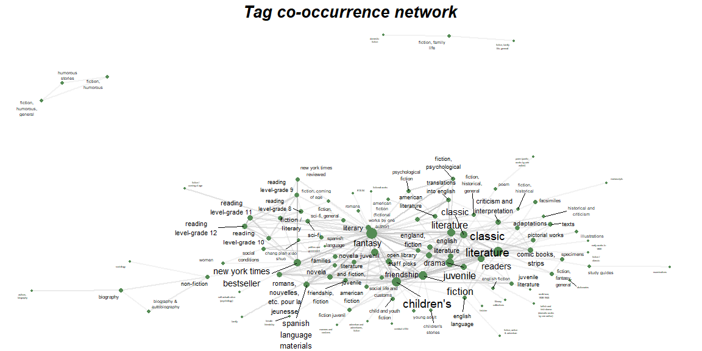
